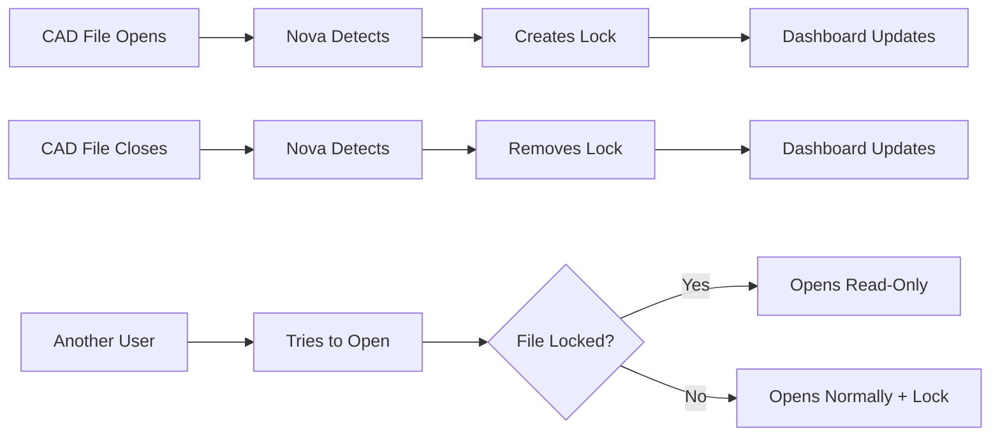

# Nova ⭐

[](https://opensource.org/licenses/MIT)

A modern, intelligent CAD file locking system for team collaboration. Prevent conflicts when multiple engineers work with CAD files simultaneously.

## 🎯 What is Nova?

Nova automatically manages file locks for CAD applications (SolidWorks, AutoCAD, Inventor, etc.) to prevent conflicts in team environments. When someone opens a CAD file, Nova locks it. When they close it, Nova unlocks it. Simple, automatic, and reliable.

**🔗 CADLock Compatible**: Nova uses the same network directory structure as CADLock, so teams can migrate seamlessly or run both systems side-by-side.

### Key Features

- **🤖 Intelligent Locking**: Auto-detects open CAD files and manages locks
- **🌐 Web Dashboard**: Real-time monitoring of all locks across your team
- **⚡ Zero Configuration**: Works out-of-the-box with sensible defaults
- **🛡️ Secure**: User-based permissions and automatic stale lock cleanup
- **📱 Modern UI**: Beautiful, responsive dashboard with live updates
- **🔧 Universal**: Supports all major CAD applications and file formats

## ⚡ Quick Start

### Installation

```bash
# 1. Clone and setup
git clone https://github.com/your-org/nova.git
cd nova
pip install -r requirements.txt

# 2. Make nova command globally available
export PATH="$(pwd):$PATH"
echo 'export PATH="$(pwd):$PATH"' >> ~/.zshrc  # or ~/.bashrc on Linux

# 3. Start Nova services
nova start

# 4. Access dashboard
open http://localhost:3000
```

That's it! Nova is now running and ready to manage your CAD files.

**Alternative (if PATH setup doesn't work):**
```bash
# Use python prefix for all commands
python nova start
python nova status
python nova stop
```

### Core Commands

```bash
# Service Management
nova start          # Start Nova and web dashboard
nova stop           # Stop all services  
nova status         # Show service status and active locks
nova restart        # Restart services

# File Operations
nova open "file.sldprt"     # Check and lock file for editing
nova lock "file.sldprt"     # Create manual lock
nova unlock "file.sldprt"   # Remove lock
nova check "file.sldprt"    # Check lock status
nova unlock-all             # Remove all your locks
nova cleanup [hours]        # Clean up old locks (default: 24h)

# Monitoring (Optional)
nova start-monitor   # Auto-detect and lock open CAD files
nova stop-monitor    # Stop automatic monitoring
```

**💡 Tip**: If `nova` command isn't found, either restart your terminal or use `python nova` instead of `nova`.

## 📊 Web Dashboard

When Nova is running, access the dashboard at **http://localhost:3000**:

- 📁 **Active Locks**: See all locked files across your team
- 👥 **User Activity**: Track who has what files open
- 📈 **Statistics**: Lock counts, file types, and usage patterns  
- 🔧 **Management**: Remove locks, cleanup stale entries
- 🚨 **Real-time**: Live updates as files are opened/closed

## 🔧 Advanced Configuration

### Custom Lock Directory

```bash
# Set custom location (optional)
export NOVA_LOCKS_DIR="/path/to/shared/locks"
python nova start
```

### Team Setup

Nova uses the **same network location as CADLock** for seamless compatibility:

**Default Behavior by Platform:**

**Windows (Production):**
```
G:\Shared drives\Cosmic\Engineering\50 - CAD Data\
├── Locks\          ← CADLock's lock files  
└── NovaLocks\      ← Nova's lock files (auto-created)
```

**macOS/Linux (Development):**
```
./locks/            ← Local development directory
```

**Windows Setup:**
```bash
# Ensure G: drive is mapped to your shared location
net use G: \\server\shared-engineering
python nova start  # Uses CADLock-compatible location automatically
```

**Custom Location (Optional):**
```bash
# macOS/Linux: Mount and set custom path
export NOVA_LOCKS_DIR="/mnt/shared/nova-locks"
python nova start

# Cloud Storage: All team members use same cloud folder  
export NOVA_LOCKS_DIR="~/GoogleDrive/NovaLocks"
python nova start
```

## 🎯 How It Works



## 🛠️ Supported Applications

Nova automatically works with:

**CAD Software:**
- SolidWorks (.sldprt, .sldasm, .slddrw)
- AutoCAD (.dwg, .dxf)
- Autodesk Inventor (.ipt, .iam, .idw)
- Fusion 360 (.f3d, .f3z)
- Generic CAD (.step, .stp, .iges, .igs)

**File Formats:**
Nova supports 17+ CAD file extensions and can be easily extended for custom formats.

## 📈 Enterprise Features

- **CADLock Migration**: Drop-in replacement with same network directory structure
- **Multi-user Support**: Concurrent access with proper conflict resolution
- **Real-time Sync**: Instant updates across all connected clients  
- **Automatic Cleanup**: Removes stale locks from crashed applications
- **Usage Analytics**: Track file usage patterns and team productivity
- **Security**: User-based permissions and access control
- **Scalability**: Handles hundreds of concurrent users and thousands of files

## 🔍 Troubleshooting

```bash
# Check if Nova is running
python nova status

# View recent logs
python nova logs

# Clean up old locks
python nova cleanup 1  # Remove locks older than 1 hour

# Reset everything
python nova stop && python nova start
```

## 🤝 Contributing

Nova is open-source! Contributions welcome:

1. Fork the repository
2. Create a feature branch
3. Make your changes
4. Submit a pull request

## 📞 Support
- For any new feature suggestion in Nova or bugs you come across, please create an issue: [GitHub Issues](https://github.com/agg111/nova/issues)


## 🙏 Acknowledgments

Inspired by the original [CADLock project](https://github.com/Cosmic-Robotics/CADLock)

## 📝 License

MIT License - see [LICENSE](LICENSE) for details.


